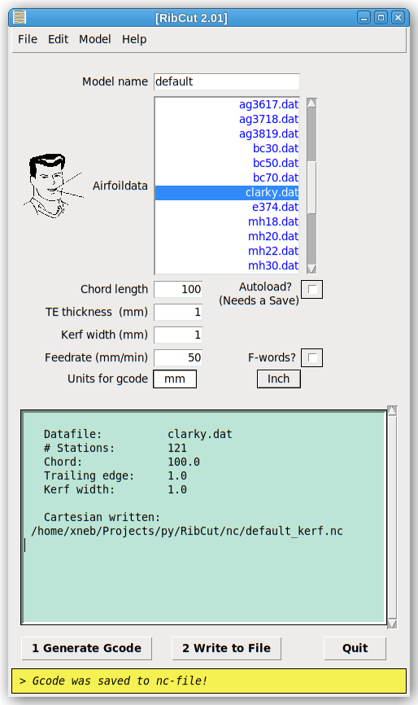

RibCut v2
===

This program generates 2D [gcode](http://en.wikipedia.org/wiki/Gcode) from airfoil data stored in the common [Selig](http://openvsp.org/wiki/doku.php?id=airfoilexport#:~:text=Bezier%20*.bz%20format.-,Selig%20Format,-The%20Selig%20airfoil) format. **RibCut** is a much reduced and simplified version of the more complex **Wing G-Code** [(https://github.com/swarfer/winggcode)](https://github.com/swarfer/winggcode), which is an application aimed at 3D hotwire cutting of model airplane foam wings.

The kerf-compensated gcode created with RibCut is instead primarily used for cutting balsa wing ribs with a prototype grbl-based CNC scroll-saw machine called '**GeeSaw**'. A database of airfoils in the Selig DAT format is included, or you can add your own.

## Install

1. Download the master.zip file. You also need Python3 installed.

1. Unzip it anywhere you want.

1. On first run you will need to define the NC and DAT directories from the Edit menu. 
  The DAT Directory variable must point at the 'koord' directory where all the .dat files are. 
  The NC Directory can be anywhere convenient.  All Gcode will be saved there.

1. Close and re-open the program and you should see the airfoil lists populate.

## Usage

Just fill in the various edit fields and click <pre><code><b>1 Test</b></code></pre>  **`1 Generate Gcode`**, then **`2 Write to File`**. How simple can it get?
 
 

